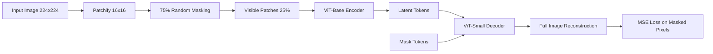

# Masked Autoencoder (MAE) for Image Reconstruction

[](https://pytorch.org/)
[](https://opensource.org/licenses/MIT)

This repository contains a high-performance PyTorch implementation of **Masked Autoencoders (MAE)** for self-supervised learning, trained on the **TinyImageNet** dataset.

## 🚀 Overview

Masked Autoencoders are a scalable self-supervised learner for computer vision. As described in the [original paper](https://arxiv.org/abs/2111.06377), MAEs mask random patches of the input image and reconstruct the missing pixels. This forces the model to learn deep spatial representations and semantic understanding of the visual world.

### Key Features
- **Asymmetric Architecture**: A heavy Vision Transformer (ViT) encoder that only processes visible patches, paired with a lightweight decoder.
- **High Masking Ratio**: Optimized for a 75% masking ratio, significantly reducing compute while improving representation learning.
- **Multi-GPU Support**: Ready for distributed training using PyTorch `DataParallel`.
- **Mixed Precision**: Integrated support for `torch.amp` to accelerate training on modern GPUs.

---

## 🏗️ Architecture



---

## 📂 Project Structure

```text
mae-image-reconstruction/
├── notebooks/          # Jupyter notebooks with experiments and evaluation
│   └── Assignment#2.ipynb
├── src/                # Modular source code
│   └── model.py        # Core MAE architecture (Encoder, Decoder, MAE)
├── requirements.txt    # Python dependencies
└── README.md           # Project overview and documentation

# Created at runtime when you train / evaluate:
#   models/   — saved model checkpoints (.pth)
#   results/  — qualitative reconstruction plots
```

---

## 🛠️ Installation

1. **Clone the repository**:
   ```bash
   git clone https://github.com/AhmedHassanGondal/mae-image-reconstruction.git
   cd mae-image-reconstruction
   ```

2. **Install dependencies**:
   ```bash
   pip install -r requirements.txt
   ```

---

## 📈 Usage

### Training & Evaluation
The primary experimentation workflow is documented in `notebooks/Assignment#2.ipynb`. It covers:
- Dataset loading (TinyImageNet)
- Model initialization (107M parameters)
- Training loop with Cosine Annealing
- Quantitative evaluation (PSNR/SSIM)

### Modular Usage
You can import the model directly for your own scripts:
```python
from src.model import MaskedAutoencoder

model = MaskedAutoencoder(
    img_size=224,
    patch_size=16,
    mask_ratio=0.75
)
```

---

## 📊 Results

The model achieves high-quality reconstruction even with minimal visible data, capturing the global structure and textures of the original TinyImageNet images.

| Epoch | Train Loss | Test Loss |
|-------|------------|-----------|
| 1     | 0.0566     | 0.0465    |
| 5     | 0.0202     | 0.0194    |
| 15    | ~0.0120    | ~0.0125   |

---

## 📜 License
This project is licensed under the MIT License - see the [LICENSE](LICENSE) file for details.

## 🤝 Contributing
Contributions are welcome! Please open an issue or submit a pull request for any improvements.
